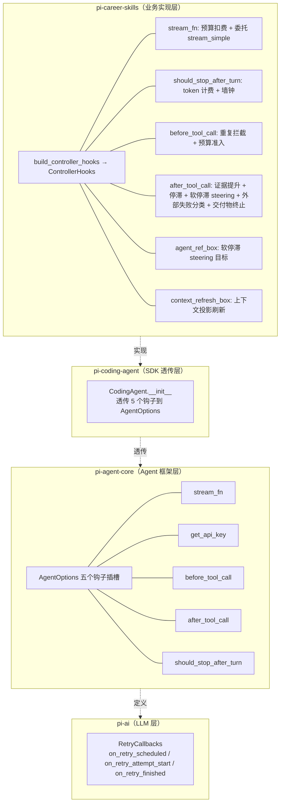
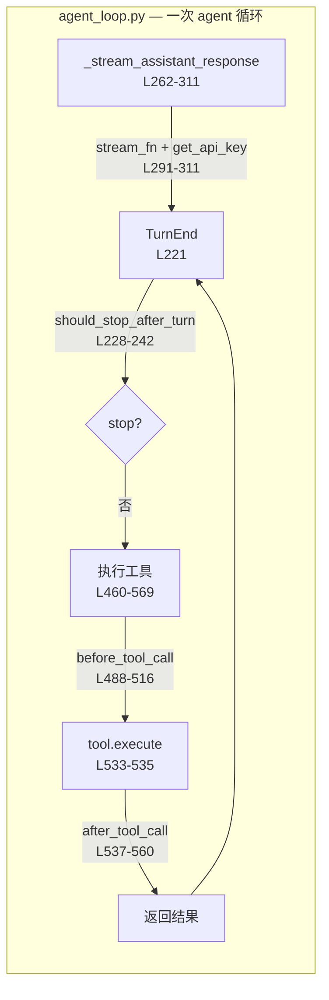
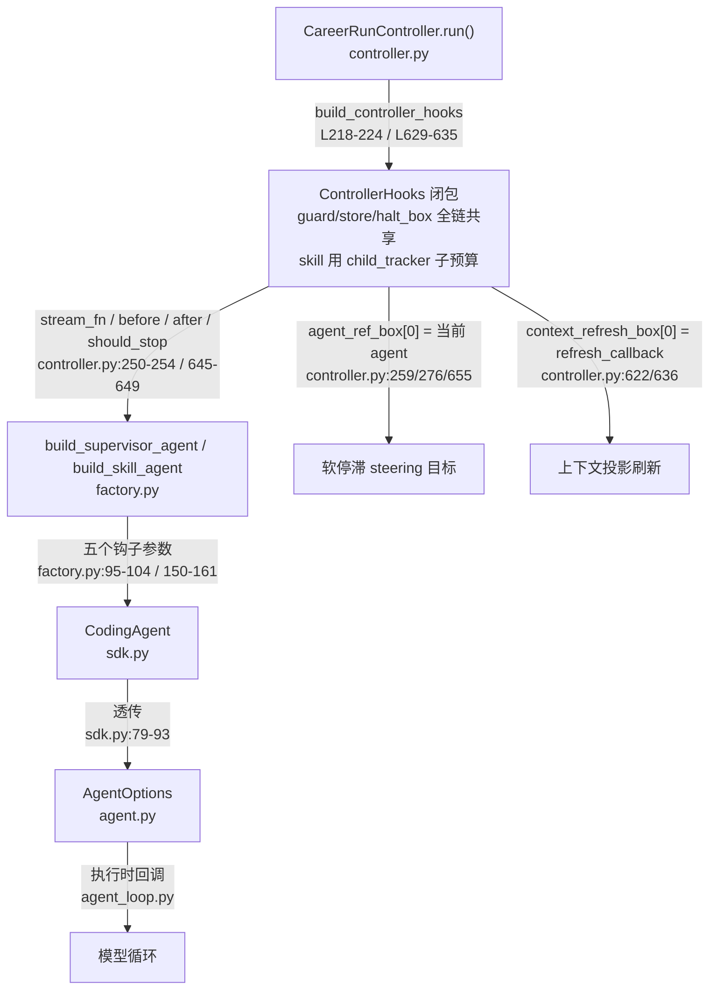
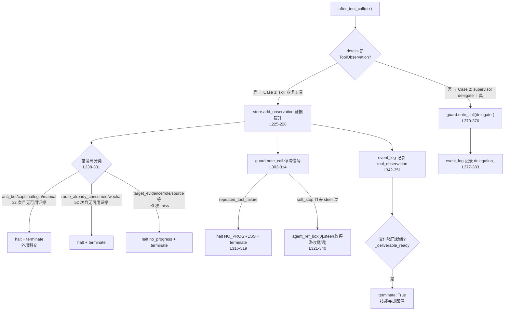

# pi-py 钩子（Hook）体系全景

> **一句话定位**：本项目把「模型循环」和「可信内核」的解耦点全部做成钩子 —— pi-ai / pi-agent-core / pi-coding-agent 提供**钩子插槽**，pi-career-skills 的 `build_controller_hooks` 提供**钩子实现**。模型不知道预算、证据、停滞、交付物门禁的存在；这些全由钩子在被调用的瞬间强制执行。
>
> **行号基线**：当前 master（commit `8adcbd6` 之后的工作区状态）。

---

## 一、四层钩子体系总览



**阅读顺序**：插槽定义在最底层（L1/L2），透传在中间（L3），**业务钩子的真正实现在 L4** —— 本文重点。

---

## 二、第 1 层：pi-agent-core `AgentOptions` 钩子插槽（定义方）

**文件**：[agent.py](packages/pi-agent-core/src/pi_agent_core/agent.py#L74-L117)（`AgentOptions.__init__`）

框架层定义了 5 个被本项目实际使用的钩子插槽，外加 3 个定义但未被本项目使用的插槽：

| 钩子 | 签名 | 调用时机 | 返回值语义 | 本项目使用? |
|---|---|---|---|---|
| `stream_fn` | `(model, context, options) → AsyncIterator[Event]` | 每轮 LLM 调用前 | 替换整个流式调用 | ✅ |
| `get_api_key` | `(provider: str) → str \| None` | 每次 LLM 调用前 | 为当前 provider 提供密钥 | ✅ |
| `before_tool_call` | `(ctx, cancel_event) → dict \| None` | **工具执行前**、参数校验后 | `{"block": bool, "reason": str, "terminate": bool}` | ✅ |
| `after_tool_call` | `(ctx, cancel_event) → dict \| None` | **工具执行后**、结果生成后 | `{"content", "details", "is_error", "terminate"}` | ✅ |
| `should_stop_after_turn` | `(ctx) → bool` | 每轮结束、下一轮开始前 | `True` = 提前终止循环 | ✅ |
| `transform_context` | `(messages, cancel_event)` | 每轮 LLM 调用前 | 改写发给模型的上下文 | ❌ 未用 |
| `convert_to_llm` | `(messages)` | 同上（在 transform 之后） | 自定义 Message → LLM Message 转换 | ❌ 未用 |
| `prepare_next_turn` | — | — | 为下一轮做准备 | ❌ 未用 |

> 说明：`AgentOptions` 还有 `steering_mode` / `follow_up_mode`（消息队列模式）——不是钩子，但 `after_tool_call` 依赖 `agent.steer()` 往 steering 队列注入软停滞指令，见下文 §5.4。

### 2.1 钩子调用点在框架内的位置



**关键机制（agent.py:273-283）**：`should_stop_after_turn` 在 Agent 级被包成 **async 包装器**再放进 `AgentLoopConfig` —— 业务钩子可以是同步函数，框架负责 `await`。

---

## 三、第 2 层：pi-coding-agent `CodingAgent` 透传（中间层）

**文件**：[sdk.py](packages/pi-coding-agent/src/pi_coding_agent/sdk.py#L50-L94)

`CodingAgent.__init__` 接收 `stream_fn / get_api_key / before_tool_call / after_tool_call / should_stop_after_turn` 五个参数，**原样透传**进 `AgentOptions`：

```python
self._agent = Agent(
    AgentOptions(
        initial_state={"system_prompt": ..., "model": model, "tools": agent_tools, ...},
        get_api_key=get_api_key,
        tool_execution=tool_execution,
        stream_fn=stream_fn,
        before_tool_call=before_tool_call,
        after_tool_call=after_tool_call,
        should_stop_after_turn=should_stop_after_turn,
    )
)
```

> 这一层是「复用 CodingAgent SDK 封装」改造引入的（计划见 `gleaming-cooking-flurry`）。它只透传、不实现；`api_key` 简写参数会被折叠成 `lambda p: api_key` 传给 `get_api_key`（sdk.py:76-78）。

---

## 四、第 3 层：pi-career-skills `ControllerHooks`（核心业务实现）

**文件**：[agent_hooks.py](packages/pi-career-skills/src/pi_career_skills/runtime/agent_hooks.py#L95-L111)

```python
@dataclass
class ControllerHooks:
    stream_fn: Any
    should_stop_after_turn: Any
    before_tool_call: Any
    after_tool_call: Any
    agent_ref_box: list[Any]        # 可变盒子: [agent | None]
    context_refresh_box: list[Callable[[], None] | None]
```

**构建入口**：`build_controller_hooks(...)`（agent_hooks.py:114-395），由 controller 在每个 attempt 构建一次。supervisor 用共享的 `tracker`（controller.py:218-224）；每个 skill 子代理用**子预算视图** `child_tracker = tracker.child(child_limits)`（controller.py:623-628，`child_limits` 由 `capability_budget_limits(skill)` 从能力注册表取默认值，[capabilities.py:150](packages/pi-career-skills/src/pi_career_skills/agents/capabilities.py#L150)）——但 `guard` / `store` / `halt_box` 是**全链共享**的（跨 delegation 连续计数、证据互通、halt 状态贯通）。

### 4.1 钩子接线图（谁把钩子交给谁）



> **supervisor 与 skill 各有一份 ControllerHooks**（controller.py:218 与 629 各调一次 `build_controller_hooks`），共享同一个 `guard` / `store` / `halt_box`，skill 的预算用 `child_tracker`（父 tracker 的子视图）—— 共享部分保证「跨代理连续计数」（如停滞判定跨 delegation 累计），子预算保证每个技能有独立预算上限。

---

## 五、四个业务钩子逐一详解

### 5.1 `stream_fn` —— 预算扣费 + 委托真实流

**实现**：agent_hooks.py:147-156

```python
def stream_fn(model, context, options=None):
    try:
        tracker.consume_turn()              # 扣 1 次 turn 配额
        tracker.consume_model_request(tokens=0)  # 扣 1 次模型请求配额
    except CareerToolError as exc:
        _record_halt(exc.code, exc.message)  # 预算耗尽 → 记录 halt
        raise
    return stream_simple(model, context, options)  # 委托给 pi-ai 真实流
```

**语义**：每一轮 LLM 调用（turn + model_request）都是要扣预算的。**这不是替换流式实现**，而是在委托 `stream_simple` 之前插一道预算门。预算耗尽的异常被记录到 `halt_box`，由控制器在下一次检查时读取 → 提前收尾。

### 5.2 `should_stop_after_turn` —— token 计费 + 墙钟检查

**实现**：agent_hooks.py:158-183

```python
def should_stop_after_turn(ctx):
    message = ctx.get("message")
    # 1. 从 usage 扣 input + cache_read + cache_creation token
    if usage is not None and input_tokens > 0:
        tracker.consume_input_tokens(input_tokens)   # 超限 → halt + 返回 True
    # 2. 墙钟检查
    if tracker.wall_clock_exhausted():
        _record_halt(WALL_CLOCK_BUDGET_EXHAUSTED, ...)
        return True
    return False
```

**语义**：每轮结束后框架调用它（agent_loop.py:229）。它的返回值决定**是否提前终止整个循环**。两个触发器：输入 token 累计超预算、或墙钟超时。

### 5.3 `before_tool_call` —— 重复拦截 + 预算准入

**实现**：agent_hooks.py:185-206

```python
def before_tool_call(ctx, cancel_event=None):
    tool_call = ctx.get("tool_call")
    params_hash = canonical_json(args)          # 参数规范化哈希
    if guard.is_duplicate(name, params_hash):   # 重复调用检测
        return {"block": True, "reason": DUPLICATE_TOOL_CALL}
    try:
        tracker.consume_tool_call(guard.artifact_count)  # 扣工具调用配额
    except CareerToolError as exc:
        _record_halt(exc.code, exc.message)
        return {"block": True, "reason": exc.code, "terminate": True}
    return None  # 放行
```

**语义**：这是**预算准入闸**。返回 `{"block": True}` 时框架跳过工具执行（agent_loop.py:501-516）；带 `terminate: True` 则同时终止后续轮次。`guard.is_duplicate` 基于「工具名 + 参数哈希」判断重复 —— 防止模型反复调用同一工具消耗预算。

### 5.4 `after_tool_call` —— 证据提升 + 停滞 + 软停滞 + 外部失败分类 + 交付物终止（最复杂）

**实现**：agent_hooks.py:208-386。这是本项目业务逻辑最重的钩子，按结果类型分两大分支：



**Case 1（skill 业务工具）关键子机制：**

1. **证据提升**（L225-228）：`store.add_observation(details)` 把工具观察提升为持久化证据；若产出新工件，触发 `context_refresh_box[0]()` 刷新上下文投影。
2. **外部失败分类**（L238-301）：三类错误码各自有计数 + 阈值（blocked≥2、route≥2、miss≥3），**仅在无可用证据时**升级为 halt —— 有部分证据时让 supervisor 有机会换允许的兜底来源。
3. **停滞信号**（L303-314）：`guard.note_call` 返回 `repeated_tool_failure` / `soft_stop` 等信号。
4. **软停滞 steering**（L321-340）：`soft_stop` 且未 steer 过时，通过 `agent_ref_box[0]` 拿到当前 agent，调用 `agent.steer(UserMessage(软停滞收尾语))` —— 这是**钩子通过 steering 队列向运行中的 agent 注入指令**的机制（agent.py:162-164）。
5. **交付物门禁**（L352-360）：`_deliverable_ready(skill_name, promoted)`（agent_hooks.py:416-457）判定该技能的契约工件是否已产出（如 job-discovery 的 `jd_complete` 页 / 真实候选，job-matching 的 `matches` 非空等），一旦就绪立即 `terminate` —— **技能完成即停，防止模型继续无谓浏览**。

**Case 2（supervisor delegate 工具）**：只记录 `delegate-<skill>` 调用与 `delegation_<status>` 事件，不涉及证据提升。

---

## 六、两个「盒子」（可变引用）

`agent_ref_box` 与 `context_refresh_box` 是**单元素可变列表**（不是钩子，但被钩子使用）：

| 盒子 | 由谁填充 | 由谁读取 | 用途 |
|---|---|---|---|
| `agent_ref_box` | controller 在每次驱动 agent 前填 `[agent]`（controller.py:259/276/655） | `after_tool_call` 软停滞分支 | 让钩子拿到**当前活跃 agent** 调 `steer()` |
| `context_refresh_box` | controller 填 `[refresh_callback]`（controller.py:622/636） | `after_tool_call` 证据提升分支 | 证据变化后刷新上下文投影 |

> **为什么用可变盒子而非参数传递**：钩子闭包在 `build_controller_hooks` 时创建，而 agent 在之后才构建。盒子让「先有钩子、后有 agent」的时序成立 —— 钩子执行时从盒子里取当前 agent 的引用。

---

## 七、未被本项目使用的钩子（了解即可）

| 钩子 | 定义处 | 本项目为何不用 |
|---|---|---|
| `transform_context` / `convert_to_llm` | agent.py:84-85 | 上下文投影用 `context_refresh_box` 实现，不需要改写发给模型的 message |
| `prepare_next_turn` | agent.py:90 | 框架备用插槽，本项目无此需求 |
| `pi_ai.RetryCallbacks`（on_retry_scheduled / on_retry_attempt_start / on_retry_finished） | pi-ai/retry.py:126-131 | pi-ai 的重试回调面向**传输层重试**；本项目的「重试」是**编排层**的 attempt 循环（controller.py:504-520 的 `retry_counts` 去重上限），由 controller 自己管理，不经过 pi-ai 的 `retry_assistant_call` |
| `Agent.subscribe(listener)` 事件订阅 | agent.py:150-158 | 事件日志走 controller 自己的 `EventLogger`，不订阅 agent 事件（`EventLogger` 的订阅通道本身也已在后续重构中删除，只剩 `append` / `events`） |
| 工具执行的 `cancel_event` / `on_update` | agent_loop.py:534 | tool_adapter.execute 接受但忽略（tool_adapter.py:291-296）——处理函数是短同步函数，取消/更新由 run 级 harness 负责 |

---

## 八、一次工具调用的完整钩子时序

```mermaid
sequenceDiagram
    participant LOOP as agent_loop.py
    participant HOOK as ControllerHooks(agent_hooks.py)
    participant TRK as BudgetTracker/Guard
    participant STORE as EvidenceStore

    LOOP->>HOOK: should_stop_after_turn(ctx)  ← 上轮结束
    HOOK->>TRK: consume_input_tokens(usage)
    HOOK-->>LOOP: False (继续)

    LOOP->>HOOK: stream_fn(model, ctx, opts)
    HOOK->>TRK: consume_turn() + consume_model_request()
    HOOK-->>LOOP: 委托 stream_simple → 模型响应

    LOOP->>HOOK: before_tool_call(ctx, cancel)
    HOOK->>TRK: is_duplicate? / consume_tool_call()
    HOOK-->>LOOP: None (放行) 或 {block, terminate}

    LOOP->>STORE: tool.execute() → ToolObservation
    LOOP->>HOOK: after_tool_call(ctx, cancel)
    HOOK->>STORE: add_observation() → 提升证据
    HOOK->>TRK: note_call() → 停滞信号
    HOOK-->>LOOP: {terminate: True} (交付物就绪/停滞) 或 None
```

---

## 九、测试覆盖

| 测试文件 | 覆盖内容 |
|---|---|
| [test_agent_scoping.py](packages/pi-career-skills/tests/test_agent_scoping.py) | 钩子经 CodingAgent 正确接线；supervisor/skill 各自 scoping |
| [test_budgets.py](packages/pi-career-skills/tests/test_budgets.py) | `stream_fn`/`before_tool_call` 的预算扣费、墙钟、重复拦截 |
| [test_recovery.py](packages/pi-career-skills/tests/test_recovery.py) | 外部失败分类、halt 后自动恢复、attempt 循环 |
| [test_state_events.py](packages/pi-career-skills/tests/test_state_events.py) | 状态机（transition / 终态）与事件日志（有界载荷、快照、run/attempt id） |
| [test_completion.py](packages/pi-career-skills/tests/test_completion.py) | `_deliverable_ready` 交付物门禁 |
| [test_controller.py](packages/pi-career-skills/tests/test_controller.py) | 控制器整链接线、软停滞 steering（`stall_soft_warning`）、agent_ref_box/context_refresh_box |
| [test_browse_tools.py](packages/pi-career-skills/tests/test_browse_tools.py) | P1/P2 工具经钩子链路的证据提升与终止行为 |

---

## 十、关键文件索引

| 文件 | 角色 |
|---|---|
| [agent.py](packages/pi-agent-core/src/pi_agent_core/agent.py#L74-L117) | `AgentOptions` 钩子插槽定义（L74-117）；steer/follow_up 队列（L162-168） |
| [agent_loop.py](packages/pi-agent-core/src/pi_agent_core/agent_loop.py) | 钩子调用点：stream/get_api_key（L291-311）、should_stop（L228-242）、before（L488-516）、after（L537-560） |
| [sdk.py](packages/pi-coding-agent/src/pi_coding_agent/sdk.py#L50-L94) | CodingAgent 透传层 |
| [agent_hooks.py](packages/pi-career-skills/src/pi_career_skills/runtime/agent_hooks.py) | **业务钩子唯一实现**（`build_controller_hooks` + `ControllerHooks`） |
| [factory.py](packages/pi-career-skills/src/pi_career_skills/agents/factory.py#L53-L162) | supervisor/skill agent 接线 |
| [controller.py](packages/pi-career-skills/src/pi_career_skills/runtime/controller.py) | 钩子装配（L218-255）、skill 子钩子（L622-650）、get_api_key 默认解析（L917-927）、编排层重试（L483-534） |
| [tool_adapter.py](packages/pi-career-skills/src/pi_career_skills/tool_adapter.py#L284-L296) | 工具执行钩子（cancel/update 接受不用） |
