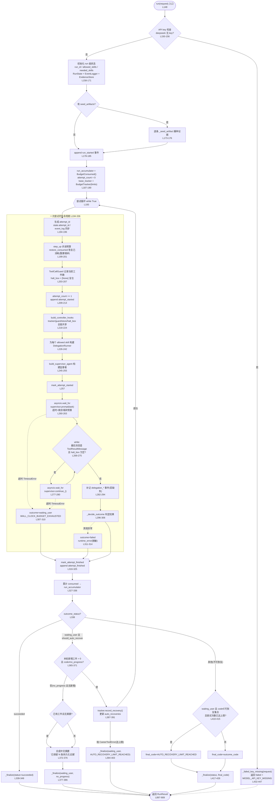

# `CareerRunController.run()` 调用流程图解读

> **来源文件**：[controller.py](packages/pi-career-skills/src/pi_career_skills/runtime/controller.py)（`packages/pi-career-skills/src/pi_career_skills/runtime/controller.py`）
> **方法**：`CareerRunController.run()`（[controller.py:148-426](packages/pi-career-skills/src/pi_career_skills/runtime/controller.py#L148-L426)）
> **行号基线**：当前 master（commit `8adcbd6` 之后的工作区状态）。
> **一句话定位**：run() 是运行级调度循环 —— 用「预算 + 证据 + 完成检查器」三条可信支柱包装不可信的模型循环，`RunRequest` 进、`RunResult` 出，中间是"可自动恢复的尝试循环"。

---

## 一、run() 在控制器中的位置

- **签名**：`async def run(self, request: RunRequest) -> RunResult` —— 整个 `CareerRunController` 唯一的对外入口。
- **权威原则**：run() 从不直接信任模型输出。完成与否由 `EvidenceStore` + `RunCompletionPolicy.SKILL_CHECKERS`（定义于 [completion.py:249](packages/pi-career-skills/src/pi_career_skills/runtime/completion.py#L249)，控制器经 `RunCompletionPolicy.SKILL_CHECKERS` 使用）判定，预算由 `BudgetTracker` 强制，异常统一映射到受控错误码。
- **一次 run = 多次 attempt**：每次 attempt 都是"构建 fresh supervisor → 驱动它自由委派 4 个技能子代理 → 判定结果"。可自动恢复的错误会带着**已累计的预算与已持久化的证据**进入下一轮 attempt。

---

## 二、调用流程图（mermaid 渲染）

> 若在支持 mermaid 的渲染器中无法显示，请检查代码围栏语言是否为 `mermaid`（本仓库的 GitHub / VS Code Markdown 预览均可渲染）。

---

## 三、流程分阶段详解

### 阶段 0：API key 快速失败（[L150-156](packages/pi-career-skills/src/pi_career_skills/runtime/controller.py#L150-L156)）

- 检查主模型与所有路由模型：只要 provider 是 `deepseek` 且拿不到 key，立即走 `_failed_key_missing`（[L432-447](packages/pi-career-skills/src/pi_career_skills/runtime/controller.py#L432-L447)）返回 `failed` + `MODEL_API_KEY_MISSING`。
- **零尝试、零模型循环** —— 这是 fail-fast，避免空转浪费。

### 阶段 1：run 级初始化（[L158-190](packages/pi-career-skills/src/pi_career_skills/runtime/controller.py#L158-L190)）

| 步骤 | 行号 | 说明 |
|---|---|---|
| run_id / skills 派生 | L159-162 | `run_id` 未给则 `uuid4().hex`；`needed_skills` 缺省 = `allowed_skills` |
| 状态与事件骨架 | L164-171 | `RunState`、`EventLogger`、`EvidenceStore` —— 三者贯穿整个 run 及其全部 attempt |
| 证据播种 | L173-176 | 若有 `seed_artifacts`（链路投影 Phase 8），逐条 `_seed_artifact` 投进证据库 |
| run_started 事件 | L178-185 | 记录 user_id / allowed / needed |
| 预算基座 | L187-190 | `run_accumulator` **跨尝试累计**已消耗；`base_tracker` 是每轮步进的基准 |

### 阶段 2：单次尝试（attempt）生命周期（[L193-336](packages/pi-career-skills/src/pi_career_skills/runtime/controller.py#L193-L336)）

**2.1 尝试预备（L194-255）**

- **L194-196**：每次尝试生成新 `attempt_id`，同步写进 `state` 与 `event_log`。
- **L199-201**：`base_tracker.step_up(attempt_count)` 允许后续尝试拿到更多预算；`restore_consumed(run_accumulator, reset_wall_clock=True)` 把历史已消耗恢复进新 tracker（墙钟重置，即"墙钟预算是**每次尝试独立计时**，而轮次/工具/请求/token 是**全 run 累计**"）。
- **L203-207**：`ToolCallGuard` 记录当前工件数（停滞检测基线）；`halt_box = [None]` 复位 —— 这是一个长度为 1 的可变容器，supervisor 与技能子代理的钩子都通过它传递"停止信号 (skill, reason)"。
- **L218-224**：`build_controller_hooks` 建一套钩子，`tracker / guard / store / halt_box / event_log` **全链共享**（supervisor 与子代理用同一套真相源）。
- **L226-242**：为每个 allowed skill 调 `_make_runner_for_skill` 生成 `DelegationRunner` 闭包 —— supervisor 的 `delegate-<skill>` 工具就是调它（同步函数，内部 `asyncio.run` 驱动异步子代理循环，见 [L461-536](packages/pi-career-skills/src/pi_career_skills/runtime/controller.py#L461-L536)）。
- **L245-255**：`build_supervisor_agent` 每次 attempt **构建 fresh supervisor**（不复用旧状态，保证恢复后是干净的监督者）。

**2.2 supervisor 驱动（L257-294）**

- **L260-263**：`asyncio.wait_for(supervisor.prompt(task), timeout=剩余墙钟)` —— 超时兜底是 `max(0.1, ...)` 防非正超时。
- **L269-280（图中 A10/A11 内环）**：只要最后一条消息是 `ToolResultMessage` 且无 halt，就继续 `supervisor.continue_()`。**设计意图**：工具调用结束后总让 supervisor 再产出一轮最终文本，让完成策略拿到摘要 —— 即使所有必需技能早已满足。
- **L282-294**：某些 pi-agent-core 版本对旧式终止委派结果不触发回调；完成状态是权威的，所以在事件流里补记 `delegation_success` 审计事件（有 `delegation_*` 就跳过，避免重复）。

**2.3 结果判定与尝试收尾（L296-336）**

- **L296-306**：调 `_decide_outcome`（[L734-853](packages/pi-career-skills/src/pi_career_skills/runtime/controller.py#L734-L853)）得到 `(status, code, msg)` —— 内部包含 halt 处理、模型 stop_reason 检查、matching 降级（§6.6）、完成策略求值，见第四节附录。
- **L307-310**：`TimeoutError` → `waiting_user` + `WALL_CLOCK_BUDGET_EXHAUSTED`。
- **L311-314**：任何其他异常 → `failed` + `runtime_error`，消息经 `redact_message` 脱敏（防 API key 等泄露）。
- **L316-336**：`mark_attempt_finished()`、记 `attempt_finished` 事件、把本次消耗并入 `run_accumulator`。

### 阶段 3：结果分派与自动恢复（[L338-426](packages/pi-career-skills/src/pi_career_skills/runtime/controller.py#L338-L426)）

**分支一：`succeeded`（L339-349）** → 直接 `_finalize(succeeded)` 返回。

**分支二：`waiting_user` 且 `should_auto_recover(code, attempt-1, limits)` 为真（L351-404）** —— 进入自动恢复决策：

1. **无进展短路（L365-386）**：若本轮新增工件数为 0 且原因是 `no_progress`，**不再白花一轮完整 supervisor 尝试**（注释引用 Q034/Q040/Q046/Q148/R024/R025/R043 等真实失败模式 —— 同样的证据只会重复同样的失败）。此时若已有持久化工件但无摘要，合成中文摘要「已保留 N 条持久化证据；本轮因 no_progress 未继续重复尝试」，直接 `_finalize(waiting_user, no_progress)`。
2. **记录恢复（L387-404）**：`tracker.record_recovery()` 成功 → 更新 `run_accumulator.auto_recoveries` → `continue` 进入下一轮 attempt（**带着已累计的预算和已持久化的证据**）。
3. **达到上限（L394-403）**：`record_recovery` 抛 `CareerToolError` → 以 `AUTO_RECOVERY_LIMIT_REACHED` 收尾。

**分支三：其他（不可恢复，L406-426）** → 若原因是可恢复类型但尝试次数已达上限，把最终错误码替换为 `AUTO_RECOVERY_LIMIT_REACHED`（比原始错误对用户更有信息量），否则用原始 code；然后 `_finalize`。

### 阶段 4：`_finalize`（[L859-909](packages/pi-career-skills/src/pi_career_skills/runtime/controller.py#L859-L909)）

- **非成功也补部分答案（L872-878）**：`waiting_user` / `failed` 的 run 调用 `build_partial_answer(store)`（[partial_answer.py:97](packages/pi-career-skills/src/pi_career_skills/runtime/partial_answer.py#L97)），只读持久化证据、按 error_code 附说明、带 apply/source 链接地渲染一段**确定性、有界、可溯源**的摘要 —— 预算/墙钟/证据不足/反爬终止时用户依然拿得到已收集的成果，且不可能编造未观察到的岗位。
- `transition` 把 `RunState` 转到终态（写状态/错误码/摘要）。
- 追加 `run_finalized` 事件（含 status / error_code / attempt_count / completed_skills）。
- 组装 `RunResult`：`store.refs()` 引用、`_serialize_artifacts` 序列化工件（供链路投影播种下一环节）、完整事件流、`tracker.consumed()` 预算。

---

## 四、run() 调用的外部函数清单

| 调用点（行号） | 被调函数 | 职责 |
|---|---|---|
| L150-156 | `_failed_key_missing`（[L432](packages/pi-career-skills/src/pi_career_skills/runtime/controller.py#L432-L447)） | 零尝试失败结果 |
| L174-176 | `_seed_artifact`（[L453-455](packages/pi-career-skills/src/pi_career_skills/runtime/controller.py#L453-L455)） | 链路工件播种进证据边界 |
| L199-201 | `BudgetTracker.step_up` / `restore_consumed` | 预算步进与跨尝试恢复 |
| L218 / L629 | `build_controller_hooks` | 构造全链共享钩子（含子代理一套） |
| L230 | `_make_runner_for_skill`（[L461-536](packages/pi-career-skills/src/pi_career_skills/runtime/controller.py#L461-L536)） | 构造单技能委派 runner（含重试熔断） |
| L245 | `build_supervisor_agent`（factory） | 构建 fresh 监督者 |
| L296 | `_decide_outcome`（[L734](packages/pi-career-skills/src/pi_career_skills/runtime/controller.py#L734-L853)） | 判定本次尝试结果（halt/模型错误/降级/完成策略） |
| L354 | `should_auto_recover`（recovery 模块） | 错误码 + 尝试次数 → 是否可自动恢复 |
| L388 | `tracker.record_recovery` | 记录一次自动恢复（达上限抛 `CareerToolError`） |
| L339 等 | `_finalize`（[L859](packages/pi-career-skills/src/pi_career_skills/runtime/controller.py#L859-L909)） | 部分答案 + 终态迁移 + 组装 `RunResult` |

---

## 五、关键机制速览

1. **halt_box 共享**（L207）：长度 1 的可变列表，supervisor 与子代理钩子都往里写停止信号 —— 用可变容器是为了跨闭包/子代理传引用。
2. **run_accumulator 跨尝试累计**（L188 / L327-336）：token / 轮次 / 工具 / 请求是**全 run 硬顶**，墙钟预算**每 attempt 重置**。
3. **恢复必须改变证据或路由**（L365-386）：无新增工件的 `no_progress` 直接收尾，不重复尝试 —— 这是对真实失败模式（Q034/Q040 等）的修复。
4. **反爬事实跨尝试保留**（[L753-778](packages/pi-career-skills/src/pi_career_skills/runtime/controller.py#L753-L778)）：一旦公共源返回过 anti-bot/captcha/login/手动审核，后续 halt 一律升级为 `anti_bot_challenge`，不让用户重复已知的人工交接。
5. **模型永远不是完成证据**：`_decide_outcome` 里所有"成功"路径都要求 `store.job_bearing_artifacts()` 或完成检查器通过，模型话术只用于生成摘要。

---

## 六、异常路径汇总

| 异常/信号 | 处理位置 | outcome_status | outcome_code |
|---|---|---|---|
| deepseek 无 API key | L150-156 | `failed` | `MODEL_API_KEY_MISSING` |
| `asyncio.TimeoutError`（prompt / continue_ / 子代理） | L307-310 / L715-721 | `waiting_user` / `retryable`(子代理) | `WALL_CLOCK_BUDGET_EXHAUSTED` |
| 任意其他异常 | L311-314 | `failed` | `runtime_error`（脱敏） |
| 自动恢复达上限 | L394-403 / L410-415 | `waiting_user` | `AUTO_RECOVERY_LIMIT_REACHED` |
| 无进展且无新增工件 | L365-386 | `waiting_user` | `no_progress`（保留已有证据收尾） |
| 模型 stop_reason=error/aborted | [L793-808](packages/pi-career-skills/src/pi_career_skills/runtime/controller.py#L793-L808) | `waiting_user` | `INVALID_MODEL_RESPONSE` |
| 反爬挑战历史 + 预算类 halt | [L753-778](packages/pi-career-skills/src/pi_career_skills/runtime/controller.py#L753-L778) | `waiting_user` | `anti_bot_challenge` |
| 完成证据胜出（halt 但 skills 齐 + 有工件） | [L779-790](packages/pi-career-skills/src/pi_career_skills/runtime/controller.py#L779-L790) | `succeeded` | — |
