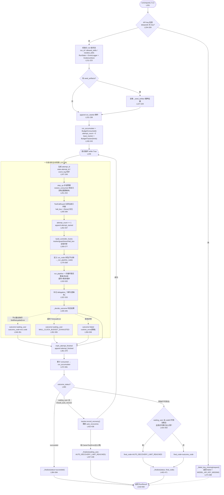

# `CareerRunController.run()` 调用流程图解读

> **来源文件**：[controller.py](packages/pi-career-skills/src/pi_career_skills/runtime/controller.py)（`packages/pi-career-skills/src/pi_career_skills/runtime/controller.py`）
> **方法**：`CareerRunController.run()`（[controller.py:201-471](packages/pi-career-skills/src/pi_career_skills/runtime/controller.py#L201-L471)）
> **行号基线**：当前工作区状态（supervisor → 确定性流水线 → LangGraph 换纯循环重构后，含未提交改动）。
> **一句话定位**：run() 是运行级调度循环 —— 用「预算 + 证据 + 完成检查器」三条可信支柱包装不可信的模型循环，`RunRequest` 进、`RunResult` 出，中间是"可自动恢复的尝试循环"。

---

## 一、run() 在控制器中的位置

- **签名**：`async def run(self, request: RunRequest) -> RunResult` —— 整个 `CareerRunController` 唯一的对外入口。
- **权威原则**：run() 从不直接信任模型输出。完成与否由 `EvidenceStore` + `RunCompletionPolicy.SKILL_CHECKERS`（定义于 [completion.py:249](packages/pi-career-skills/src/pi_career_skills/runtime/completion.py#L249)，控制器经 `RunCompletionPolicy.SKILL_CHECKERS` 使用）判定，预算由 `BudgetTracker` 强制，异常统一映射到受控错误码。
- **一次 run = 多次 attempt**：每次 attempt 都是"调一次 `run_pipeline` 按固定顺序跑完 4 个技能节点 → 判定结果"。可自动恢复的错误会带着**已累计的预算与已持久化的证据**进入下一轮 attempt。

---

## 二、调用流程图（mermaid 渲染）

> **节点级重试**：图中 A7 的 `run_pipeline`（[controller.py:72-108](packages/pi-career-skills/src/pi_career_skills/runtime/controller.py#L72-L108)）对抛 `SkillRetryableError` 的节点**重试一次**（L101-105，对旧图节点级 `RetryPolicy(max_attempts=2)` 的等价替换）；`_run_pipeline_node` 在委派结果为 retryable 时抛 `SkillRetryableError`（L558-562），由循环重试，重试耗尽后异常冒泡到 run 循环的 E1 分支。

> **不可达代码说明**：源码 run() 的 [L410-431](packages/pi-career-skills/src/pi_career_skills/runtime/controller.py#L410-L431) 仍保留一个「本轮新增工件为 0 且 code=no_progress 则直接收尾、合成『已保留 N 条持久化证据』摘要」的短路分支，但它是**当前不可达的死代码**：`no_progress` / `budget_exhausted` 都不在 `AUTO_RECOVERABLE_REASONS`（[recovery.py L27-38](packages/pi-career-skills/src/pi_career_skills/runtime/recovery.py#L27-L38)）里，`should_auto_recover` 对它们恒为 False，根本进不了「waiting_user 且可自动恢复」分支；实际执行时这两种错误码走 D2/D4「其他(不可恢复)」分支直接 `_finalize`（L462-471），保留已持久化的证据、错误码原样返回。该短路是重构前遗留，未在本轮引入（教案 4.2 的描述与此一致）。

> 若在支持 mermaid 的渲染器中无法显示，请检查代码围栏语言是否为 `mermaid`（本仓库的 GitHub / VS Code Markdown 预览均可渲染）。

---

## 三、流程分阶段详解

### 阶段 0：API key 快速失败（[L204-209](packages/pi-career-skills/src/pi_career_skills/runtime/controller.py#L204-L209)）

- 检查主模型与所有路由模型：只要 provider 是 `deepseek` 且拿不到 key，立即走 `_failed_key_missing`（[L477-489](packages/pi-career-skills/src/pi_career_skills/runtime/controller.py#L477-L489)）返回 `failed` + `MODEL_API_KEY_MISSING`。
- **零尝试、零模型循环** —— 这是 fail-fast，避免空转浪费。

### 阶段 1：run 级初始化（[L211-243](packages/pi-career-skills/src/pi_career_skills/runtime/controller.py#L211-L243)）

| 步骤 | 行号 | 说明 |
|---|---|---|
| run_id / skills 派生 | L212-215 | `run_id` 未给则 `uuid4().hex`；`needed_skills` 缺省 = `allowed_skills` |
| 状态与事件骨架 | L217-223 | `RunState`、`EventLogger`、`EvidenceStore` —— 三者贯穿整个 run 及其全部 attempt |
| 证据播种 | L227-229 | 若有 `seed_artifacts`（链路投影 Phase 8），逐条 `_seed_artifact` 投进证据库 |
| run_started 事件 | L231-238 | 记录 user_id / allowed / needed |
| 预算基座 | L240-243 | `run_accumulator` **跨尝试累计**已消耗；`base_tracker` 是每轮步进的基准 |

### 阶段 2：单次尝试（attempt）生命周期（[L247-381](packages/pi-career-skills/src/pi_career_skills/runtime/controller.py#L247-L381)）

**2.1 尝试预备（L247-308）**

- **L247-249**：每次尝试生成新 `attempt_id`，同步写进 `state` 与 `event_log`。
- **L251-254**：`base_tracker.step_up(attempt_count)` 允许后续尝试拿到更多预算；`restore_consumed(run_accumulator, reset_wall_clock=True)` 把历史已消耗恢复进新 tracker（墙钟重置，即"墙钟预算是**每次尝试独立计时**，而轮次/工具/请求/token 是**全 run 累计**"）。
- **L256-260**：`ToolCallGuard` 记录当前工件数（停滞检测基线）；`halt_box = [None]` 复位 —— 这是一个长度为 1 的可变容器，所有技能节点共享的钩子都通过它传递"停止信号 (skill, reason)"。
- **L269-277**：`build_controller_hooks` 建一套钩子，`tracker / guard / store / halt_box / event_log` **全链共享**（四个技能节点与子代理用同一套真相源）。
- **L279-308**：定义 `run_node(skill, state)` 异步闭包（节点体 → `_run_pipeline_node`，把 tracker/guard/hooks/halt_box/private_ctx 等按默认参数绑定，避免闭包共享循环变量）。路由语义由 `run_pipeline`（[controller.py:72-108](packages/pi-career-skills/src/pi_career_skills/runtime/controller.py#L72-L108)）承担：四个节点按 `SKILL_ORDER`（job-discovery → job-matching → resume-tailoring → career-planning）固定顺序，第一个节点总是 job-discovery；每个节点执行一次技能委派并返回 `{completed, status, code, message}` 部分更新；只向前路由到「在 needed 里且不在 completed 里」的技能，已完成的技能绝不重跑。

**2.2 流水线驱动（L310-333）**

- **L310**：`tracker.mark_attempt_started()` 开始本轮计时。
- **L310-320**：`asyncio.wait_for(run_pipeline(run_node, task, needed, completed), timeout=剩余墙钟)` —— 整条流水线**一次循环跑完**，没有 supervisor 的 prompt/continue_ 内环；超时兜底是 `max(0.1, ...)` 防非正超时。
- **节点级重试**：`run_pipeline` 对抛 `SkillRetryableError` 的节点重试一次（L101-105，零退避）；`_run_pipeline_node` 在委派结果为 retryable 时抛 `SkillRetryableError`（L558-562），由循环重试一次，重试耗尽后异常冒泡到 run 循环。
- **L322-333**：某些 pi-agent-core 版本对旧式终止委派结果不触发回调；完成状态是权威的，所以在事件流里补记 `delegation_success` 审计事件（有 `delegation_*` 就跳过，避免重复）。

**2.3 结果判定与尝试收尾（L335-381）**

- **L335-345**：调 `_decide_outcome`（[L767-874](packages/pi-career-skills/src/pi_career_skills/runtime/controller.py#L767-L874)）得到 `(status, code, msg)` —— 内部包含 halt 处理、matching 降级（§6.6）、完成策略求值，见第四节附录。
- **L346-351**：`except SkillRetryableError` —— 节点重试耗尽后异常冒泡到此，转为 `waiting_user` + 原始错误码（`exc.code`），交给 run 级自动恢复决策。
- **L352-355**：`except TimeoutError` → `waiting_user` + `WALL_CLOCK_BUDGET_EXHAUSTED`。
- **L356-359**：任何其他异常 → `failed` + `runtime_error`，消息经 `redact_message` 脱敏（防 API key 等泄露）。
- **L361-381**：`mark_attempt_finished()`、记 `attempt_finished` 事件、把本次消耗并入 `run_accumulator`。

### 阶段 3：结果分派与自动恢复（[L383-471](packages/pi-career-skills/src/pi_career_skills/runtime/controller.py#L383-L471)）

**分支一：`succeeded`（L384-394）** → 直接 `_finalize(succeeded)` 返回。

**分支二：`waiting_user` 且 `should_auto_recover(code, attempt-1, limits)` 为真（L396-449）** —— 进入自动恢复决策：

1. **记录恢复（L432-436）**：`tracker.record_recovery()` 成功 → 更新 `run_accumulator.auto_recoveries` → `continue` 进入下一轮 attempt（**带着已累计的预算和已持久化的证据**）。
2. **达到上限（L437-448）**：`record_recovery` 抛 `CareerToolError` → 以 `AUTO_RECOVERY_LIMIT_REACHED` 收尾。

> 源码 L410-431 的「无进展短路」分支（新增工件为 0 且 code=no_progress 时直接收尾）是**不可达死代码** —— `no_progress` / `budget_exhausted` ∉ `AUTO_RECOVERABLE_REASONS`（[recovery.py L27-38](packages/pi-career-skills/src/pi_career_skills/runtime/recovery.py#L27-L38)），`should_auto_recover` 对它们恒为 False，根本进不了本分支；实际执行时此类错误码走**分支三**直接 `_finalize`（L462-471），错误码原样返回、已持久化证据保留。该短路是重构前遗留，未在本轮引入。

**分支三：其他（不可恢复，L451-471）** → 若原因是可恢复类型但尝试次数已达上限，把最终错误码替换为 `AUTO_RECOVERY_LIMIT_REACHED`（比原始错误对用户更有信息量），否则用原始 code；然后 `_finalize`。

### 阶段 4：`_finalize`（[L880-930](packages/pi-career-skills/src/pi_career_skills/runtime/controller.py#L880-L930)）

- **非成功也补部分答案（L896-899）**：`waiting_user` / `failed` 的 run 调用 `build_partial_answer(store)`（[partial_answer.py:97](packages/pi-career-skills/src/pi_career_skills/runtime/partial_answer.py#L97)），只读持久化证据、按 error_code 附说明、带 apply/source 链接地渲染一段**确定性、有界、可溯源**的摘要 —— 预算/墙钟/证据不足/反爬终止时用户依然拿得到已收集的成果，且不可能编造未观察到的岗位。
- `transition`（L900-906）把 `RunState` 转到终态（写状态/错误码/摘要）。
- 追加 `run_finalized` 事件（L908-916，含 status / error_code / attempt_count / completed_skills）。
- 组装 `RunResult`（L918-930）：`store.refs()` 引用、`_serialize_artifacts` 序列化工件（供链路投影播种下一环节）、完整事件流、`tracker.consumed()` 预算。

---

## 四、run() 调用的外部函数清单

| 调用点（行号） | 被调函数 | 职责 |
|---|---|---|
| L204-209 | `_failed_key_missing`（[L477](packages/pi-career-skills/src/pi_career_skills/runtime/controller.py#L477-L489)） | 零尝试失败结果 |
| L227-229 | `_seed_artifact`（[L498](packages/pi-career-skills/src/pi_career_skills/runtime/controller.py#L498)） | 链路工件播种进证据边界 |
| L251-254 | `BudgetTracker.step_up` / `restore_consumed` | 预算步进与跨尝试恢复 |
| L271 / L662 | `build_controller_hooks` | 构造全链共享钩子（含子代理一套） |
| L295 | `_run_pipeline_node`（[L506](packages/pi-career-skills/src/pi_career_skills/runtime/controller.py#L506-L571)） | 单节点技能委派：跑子代理 → 补记 delegation 事件 → retryable 抛 `SkillRetryableError` → 返回 `{completed, status, code, message}` |
| L313 | `run_pipeline`（[L72](packages/pi-career-skills/src/pi_career_skills/runtime/controller.py#L72-L108)，模块级） | 固定顺序循环调度四个技能节点（含每节点一次重试） |
| L335 | `_decide_outcome`（[L767](packages/pi-career-skills/src/pi_career_skills/runtime/controller.py#L767-L874)） | 判定本次尝试结果（halt/降级/完成策略） |
| L399 | `should_auto_recover`（recovery 模块） | 错误码 + 尝试次数 → 是否可自动恢复 |
| L433 | `tracker.record_recovery` | 记录一次自动恢复（达上限抛 `CareerToolError`） |
| L384 等 | `_finalize`（[L880](packages/pi-career-skills/src/pi_career_skills/runtime/controller.py#L880-L930)） | 部分答案 + 终态迁移 + 组装 `RunResult` |

---

## 五、关键机制速览

1. **halt_box 共享**（L260）：长度 1 的可变列表，所有技能节点共享的钩子都往里写停止信号 —— 用可变容器是为了跨闭包/节点传引用。
2. **run_accumulator 跨尝试累计**（L241 / L372-381）：token / 轮次 / 工具 / 请求是**全 run 硬顶**，墙钟预算**每 attempt 重置**。
3. **恢复必须改变证据或路由**（L410-431）：无新增工件的 `no_progress` 直接收尾，不重复尝试 —— 这是对真实失败模式（Q034/Q040 等）的修复。
4. **反爬事实跨尝试保留**（[L793-811](packages/pi-career-skills/src/pi_career_skills/runtime/controller.py#L793-L811)）：一旦公共源返回过 anti-bot/captcha/login/手动审核，后续 halt 一律升级为 `anti_bot_challenge`，不让用户重复已知的人工交接。
5. **模型永远不是完成证据**：`_decide_outcome` 里所有"成功"路径都要求 `store.job_bearing_artifacts()` 或完成检查器通过，模型话术只用于生成摘要。
6. **节点级重试**：`run_pipeline`（[L72-108](packages/pi-career-skills/src/pi_career_skills/runtime/controller.py#L72-L108)）对抛 `SkillRetryableError` 的节点重试一次（L101-105，对旧图节点级 `RetryPolicy(max_attempts=2)` 的等价替换）；`_run_pipeline_node` 在委派结果为 retryable 时抛 `SkillRetryableError`（L558-562），由循环重试，重试耗尽后异常冒泡到 run 循环转 `waiting_user`（L346-351）。旧的「retry_counts 熔断」（同一错误码第 2 次升级 blocked）已删除，重试现在由 `run_pipeline` 的节点级重试承担。

---

## 六、异常路径汇总

| 异常/信号 | 处理位置 | outcome_status | outcome_code |
|---|---|---|---|
| deepseek 无 API key | L204-209 | `failed` | `MODEL_API_KEY_MISSING` |
| `SkillRetryableError`（节点重试耗尽） | [L346-351](packages/pi-career-skills/src/pi_career_skills/runtime/controller.py#L346-L351) | `waiting_user` | 原始错误码（`exc.code`） |
| `asyncio.TimeoutError`（流水线 / 子代理） | L352-355（run 循环）；子代理超时在 [L748-754](packages/pi-career-skills/src/pi_career_skills/runtime/controller.py#L748-L754) → retryable → 节点抛 `SkillRetryableError` 由循环重试 | `waiting_user` / `retryable`(节点重试) | `WALL_CLOCK_BUDGET_EXHAUSTED` |
| 任意其他异常 | L356-359 | `failed` | `runtime_error`（脱敏） |
| 自动恢复达上限 | L437-448 / L454-459 | `waiting_user` | `AUTO_RECOVERY_LIMIT_REACHED` |
| 无进展且无新增工件 | L410-431 | `waiting_user` | `no_progress`（保留已有证据收尾） |
| 反爬挑战历史 + 预算类 halt | [L793-811](packages/pi-career-skills/src/pi_career_skills/runtime/controller.py#L793-L811) | `waiting_user` | `anti_bot_challenge` |
| 完成证据胜出（halt 但 skills 齐 + 有工件） | [L812-823](packages/pi-career-skills/src/pi_career_skills/runtime/controller.py#L812-L823) | `succeeded` | — |
