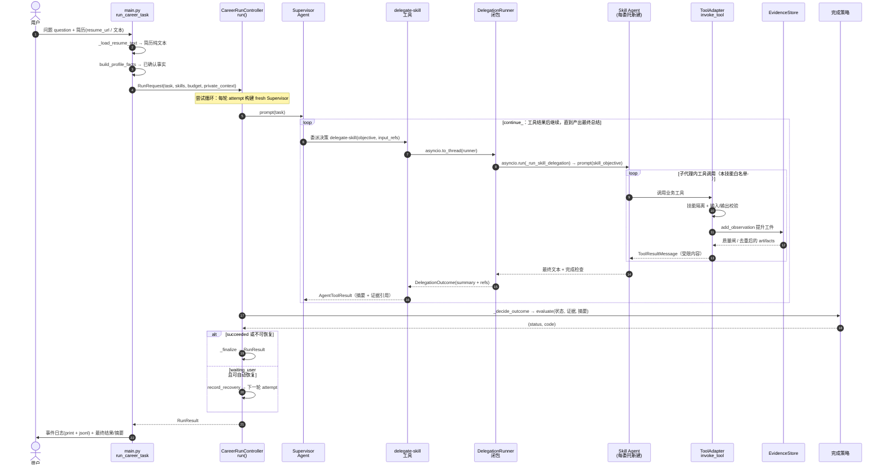
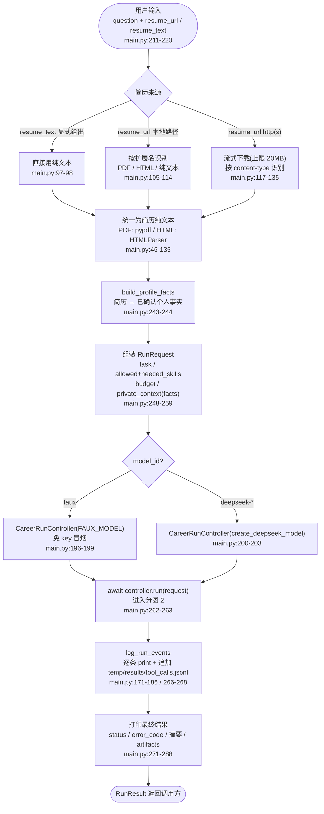
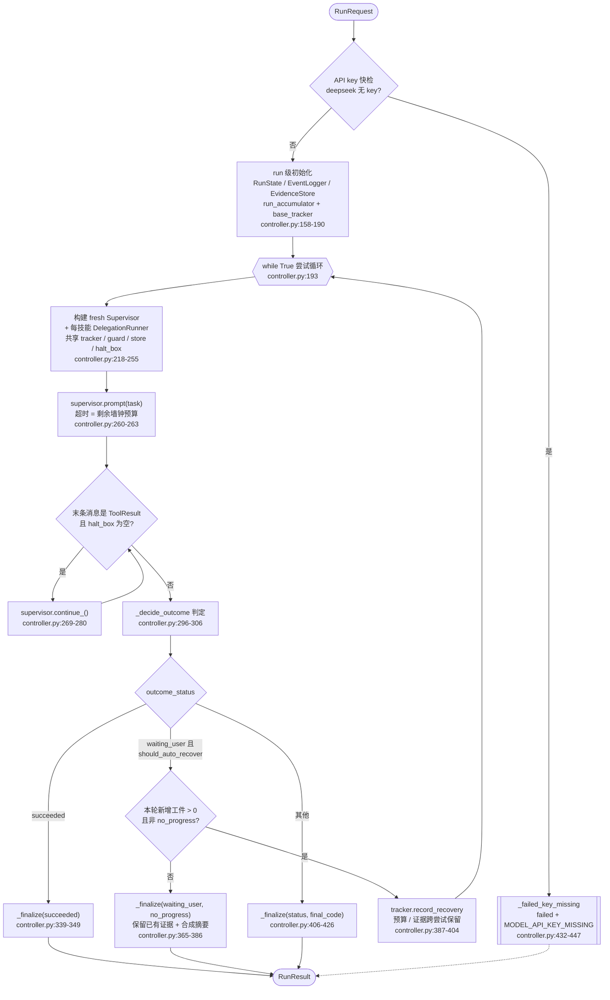
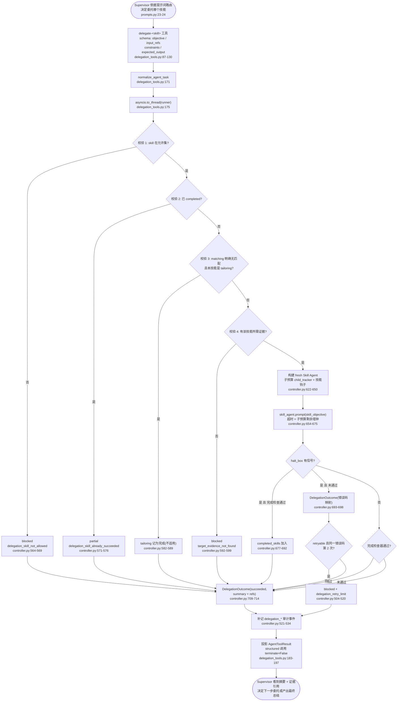
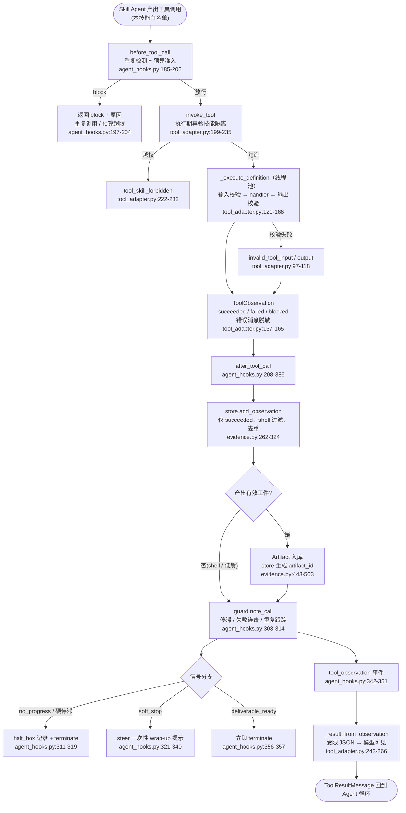
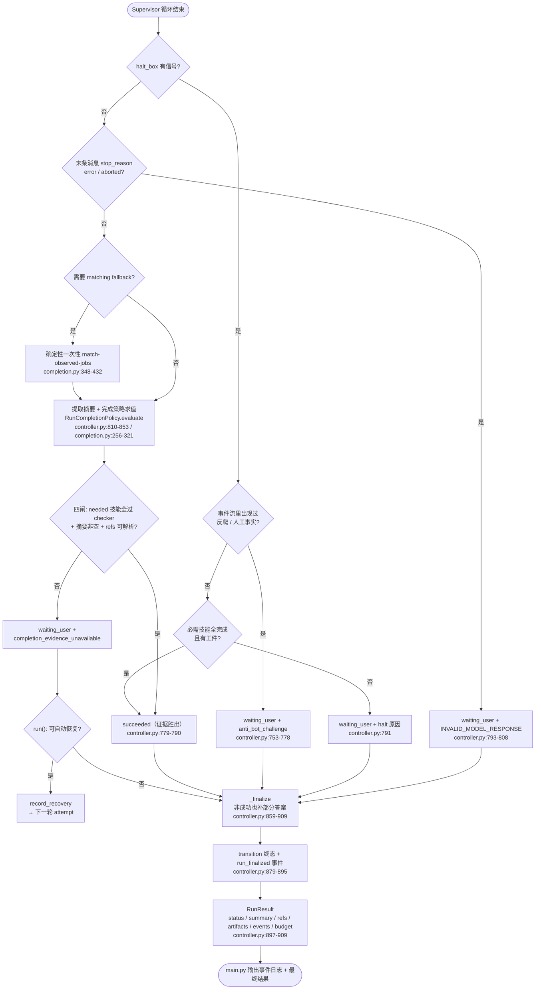

# pi-career-skills 一次完整请求的旅程 —— 总分图解读

> **来源文件**：[main.py](main.py)（仓库根入口）+ [controller.py](packages/pi-career-skills/src/pi_career_skills/runtime/controller.py) + `agents/` + `runtime/` + [tool_adapter.py](packages/pi-career-skills/src/pi_career_skills/tool_adapter.py)
> **行号基线**：当前 master（commit `8adcbd6` 之后的工作区状态）。
> **一句话定位**：一张总图（时序）看全局，五张分图看纵深 —— 从「用户输入请求」到「agent 输出结果」，一次请求依次穿过 **入口 → 控制器 run 循环 → Supervisor 委派 → 技能子代理 → 工具与证据 → 完成判定与输出** 六个层次。每个层次都遵循同一条铁律：**模型输出不被信任，预算 / 证据 / 完成门才是权威**。

---

## 〇、总分图目录

| 图 | 名称 | 覆盖范围 | 对应源码 |
|---|---|---|---|
| **总图** | 一次请求的完整时间线（时序图） | 全部六个层次 | — |
| 分图 1 | 入口层 | 用户输入 → `RunRequest` | [main.py:211-288](main.py#L211-L288) |
| 分图 2 | 控制器 `run()` 尝试循环（浓缩） | `RunRequest` → `RunResult` | [controller.py:148-426](packages/pi-career-skills/src/pi_career_skills/runtime/controller.py#L148-L426) |
| 分图 3 | 一次技能委托 | `delegate-<skill>` 工具 → 子代理循环 → 结果回传 | [controller.py:461-728](packages/pi-career-skills/src/pi_career_skills/runtime/controller.py#L461-L728) |
| 分图 4 | 一次工具调用与证据提升 | 钩子 → 适配器 → `EvidenceStore` | [agent_hooks.py:114](packages/pi-career-skills/src/pi_career_skills/runtime/agent_hooks.py#L114) + [tool_adapter.py:121](packages/pi-career-skills/src/pi_career_skills/tool_adapter.py#L121) + [evidence.py:262](packages/pi-career-skills/src/pi_career_skills/runtime/evidence.py#L262) |
| 分图 5 | 完成判定与结果输出 | 判定 → 收尾 → 返回给用户 | [controller.py:734-909](packages/pi-career-skills/src/pi_career_skills/runtime/controller.py#L734-L909) + [completion.py:256](packages/pi-career-skills/src/pi_career_skills/runtime/completion.py#L256) |

> **阅读顺序**：先看总图建立全局印象，再按需逐张看分图。分图 2 的完整逐节点版见 [run-方法调用流程图.md](run-方法调用流程图.md)。

---

## 一、总图 —— 一次完整请求的时间线（时序图）

**读图要点**：

1. **实线 = 主调用链**：用户 → 入口 → 控制器 → Supervisor → 委派 → 子代理 → 工具 → 证据 → 判定 → 输出。**虚线 = 回传/异步**。
2. **每层回传都"受限"**：委派边界只回**摘要 + 证据引用**（`DelegationOutcome.safe_refs()`，不含私有上下文与业务事实副本）；工具层只回 `bound_content` 限制后的 JSON。这是「传引用不传副本」原则的落点。
3. **两个嵌套 loop 是关键**：外层是 supervisor 的 `continue_` 内环（保证工具调用后必产出一轮最终总结）；内层是子代理自己反复调本技能工具的循环。
4. **alt 分支**：控制器拿到判定结果后二选一 —— 成功/不可恢复直接收尾；`waiting_user` 且可自动恢复则带**已累计预算 + 已持久化证据**进入下一轮 attempt（虚线回到 `Note over C`）。

> 各层次对应分图：入口=`分图 1`，控制器循环=`分图 2`，`S→D→R→K` 委派链=`分图 3`，`K→T→E` 工具与证据=`分图 4`，`C→P→C→M→U` 判定与输出=`分图 5`。

---

## 二、分图 1：入口层 —— 用户请求 → `RunRequest`

**解释**：入口把"用户的自然语言问题 + 一份简历"转成控制器唯一认得的输入契约 `RunRequest`：

- **简历预处理**在控制器之外完成 —— PDF/HTML/纯文本统一提取为纯文本（`_load_resume_text`，[main.py:90-135](main.py#L90-L135)），再经 `build_profile_facts` 收敛为**已确认个人事实**（matching/tailoring 的输入契约，防模型编造简历经历）。
- **`private_context` 承载事实与搜索约束**：`confirmed_profile_facts` + `search_route_budget`（搜索路由有界，[main.py:254-258](main.py#L254-L258)）。
- 控制器按 `model_id` 构建：`faux` 免 key 冒烟，真实模型走 `create_deepseek_model`。**API key 检查发生在控制器内部**（分图 2 的 K1），缺 key 零尝试直接失败。
- run 结束后入口只做两件事：**打印/落盘事件日志**（`tool_calls.jsonl`，每行一条事件，含 run_id/attempt_id）和**展示最终结果**。

---

## 三、分图 2：控制器 `run()` —— 尝试循环（浓缩版）

**解释**：这是运行级调度循环的浓缩（逐节点完整版见 [run-方法调用流程图.md](run-方法调用流程图.md)）。核心三点：

1. **一次 run = 多次 attempt**：每次 attempt 都是"构建 fresh Supervisor → 驱动其自由委派 → 判定结果"。可自动恢复的错误（`waiting_user`）会带着**已累计预算 + 已持久化证据**回到 `while True`（ARR→AT），墙钟预算每 attempt 重置、token/轮次/工具是 run 级硬顶。
2. **无进展短路**：本轮无新增工件且为 `no_progress` 时不再白花一轮（同样的证据只会重复同样的失败），直接保留已有证据收尾并合成摘要（F2）。
3. **`_decide_outcome` 是唯一判定出口**（A5，详见分图 5）；`succeeded` 直接 `_finalize`，其余交给自动恢复判定或最终收尾。

---

## 四、分图 3：一次技能委托 —— supervisor 决策 → 子代理循环 → 结果回传

**解释**：一次委派 = supervisor 的一次工具调用，但内部是一个完整的子代理运行：

- **四道确定性校验**（V1-V4）：skill 是否允许、是否已完成、matching 明确无匹配时 tailoring 是否不适用、证据前提是否满足 —— 全部先于模型运行，杜绝"模型重复已完成的技能"或"凭空做匹配"。证据前提（V4）以 `CapabilityDefinition.prerequisite`（`none` / `job_bearing_artifact` / `structured_job_details`）为单一事实来源，`_skill_has_evidence` 只做「声明等级 → 证据库」的映射（[controller.py:953-983](packages/pi-career-skills/src/pi_career_skills/runtime/controller.py#L953-L983)）。
- **每委托新建 fresh 子代理**（BA）：只挂本技能工具白名单，用子预算 `child_tracker` 独立计费（`capability_budget_limits(skill)` 从能力注册表取默认值，[capabilities.py:150](packages/pi-career-skills/src/pi_career_skills/agents/capabilities.py#L150)），系统提示词 = 归档 SKILL.md + 运行时适配段 + 精编项目提示（三层合成，[factory.py:108-162](packages/pi-career-skills/src/pi_career_skills/agents/factory.py#L108-L162)，合成本体在 [prompts.py:68](packages/pi-career-skills/src/pi_career_skills/agents/prompts.py#L68)）。
- **halt 信号与证据的关系**（HX）：即使子代理内触发了预算/停滞 halt，只要完成检查器已通过，**持久化证据依然胜出**（OK），不因模型多试一轮而丢弃有效交付物。
- **重试熔断**（RT→BL）：同一 `retryable` 错误码第二次出现时升级为 `blocked`，让 supervisor 换路由（**不懂**）或问用户，而不是把 run 预算烧在完全相同的失败循环上。
- **回传受限**（PV）：structured 调用 `terminate=False`，由 supervisor 的 `continue_` 内环决定何时收尾；模型只看到摘要 + 证据引用（`safe_refs`）。

---

## 五、分图 4：一次工具调用与证据提升

**解释**：这是"可信内核"真正落地的一层 —— 工具调用被三道防线包裹：

1. **调用前**（BT）：重复工具调用检测（按工具名+参数哈希）+ 预算准入（扣一次工具调用配额），超限直接 block 并 halt。
2. **执行**（IT→EX→OB）：执行期再验技能隔离（模型只能调本技能工具）；handler 在线程池跑，输入/输出都过 pydantic 校验；异常统一映射为 `succeeded / failed / blocked` 观测，错误消息**脱敏**（防 API key 泄露）。
3. **调用后**（AT→EO→PR）：`EvidenceStore.add_observation` 是**证据库唯一写入口** —— 只提升 `succeeded` 的观测、shell（空搜索/被拦页面/导航标签标题）直接丢弃、按 `(artifact_type, source_url, content_hash)` 去重、`artifact_id` 由 store 生成（**模型永远无法伪造**）。
4. **信号分支**（SG）：`no_progress`/硬停滞 → 写 halt_box 终止；soft_stop → 通过 `agent.steer` 一次性引导"基于现有证据收尾"；`deliverable_ready`（交付物已入库）→ 立即终止，防止模型继续空转。（**不懂**）
5. **模型只看到受限结果**（MR）：成功时是 `bound_content` 后的 JSON，失败时只有 status/error_code/error_message。

---

## 六、分图 5：完成判定与结果输出

**解释**：supervisor 循环结束后，`_decide_outcome`（[controller.py:734-853](packages/pi-career-skills/src/pi_career_skills/runtime/controller.py#L734-L853)）依次做四件事：

1. **halt 处理**：先看有没有硬信号 —— 一旦事件流里出现过反爬/人工事实，后续预算类 halt **一律升级为 `anti_bot_challenge`**（避免让用户重复已知的人工交接）；若必需技能已全部完成且有工件，即使 halt 也判 `succeeded`（**证据胜出**）。
2. **模型错误检查**：末条助手消息 `stop_reason` 为 `error/aborted` → `INVALID_MODEL_RESPONSE`。
3. **matching 降级**：需要 matching 且无报告时，由**确定性内核**一次性调用 `match-observed-jobs`（§6.6），不依赖模型。
4. **完成策略四闸**（CG，`RunCompletionPolicy.evaluate`）：必需技能**全部**过各自完成检查器 + 摘要非空 + 至少一个摘要 ref 能解析到 job-bearing 工件 —— **模型话术永远不是完成证据**；模型漏了可解析 ref 但工件已齐时，合成审计摘要兜底判成功（[controller.py:840-853](packages/pi-career-skills/src/pi_career_skills/runtime/controller.py#L840-L853)）。

随后 `run()` 分派（RC）：可恢复 → 下一轮 attempt；否则 `_finalize`（终态迁移 + `run_finalized` 事件 + 组装 `RunResult`）。**非成功收尾也有部分答案**（FZ）：`waiting_user` / `failed` 的 run 不再只是"报错 + 空摘要" —— `_finalize` 调用 `build_partial_answer(store)`（[controller.py:872-878](packages/pi-career-skills/src/pi_career_skills/runtime/controller.py#L872-L878) / [partial_answer.py:97](packages/pi-career-skills/src/pi_career_skills/runtime/partial_answer.py#L97)），只读持久化证据、按 error_code 附中文说明、带每条线索的 apply/source 链接地渲染一段**确定性、有界、可溯源**的摘要（预算/墙钟/证据不足/反爬终止时用户依然拿得到已收集的成果，且不可能编造未观察到的岗位）。`RunResult` 回到入口，最终以"事件日志 + 摘要 + artifacts 清单"的形式呈现给用户 —— 全程结束。

---

## 七、贯穿全程的三条可信支柱

| 支柱 | 持有者 | 出现位置 | 关键行为 |
|---|---|---|---|
| **预算** `BudgetTracker` | 控制器（run 级）+ 子代理（child） | 分图 2 / 3 / 4 | token/轮次/工具/请求 run 级硬顶；墙钟每 attempt 重置；自动恢复次数上限 |
| **证据** `EvidenceStore` | 控制器（唯一写入口 `add_observation`） | 分图 4 | 只收 succeeded、shell 丢弃、质量闸、去重、id 由 store 生成 |
| **完成门** `RunCompletionPolicy.SKILL_CHECKERS`（[completion.py:249](packages/pi-career-skills/src/pi_career_skills/runtime/completion.py#L249) 定义，控制器经 `RunCompletionPolicy.SKILL_CHECKERS` 使用） | 控制器 | 分图 3 / 5 | 每技能确定性 checker；ANY 语义 refs；模型话术永不直接算完成 |

> 三者共同保证：无论模型说什么，**没有工具调用成功 + 没有工件入库 + 没有完成检查器通过，就不可能有 `succeeded`**。

---

## 八、行号基线说明

- 基线提交：`8adcbd6` 之后的工作区状态（含未提交的 `main.py`，仓库根入口）。
- 本文件行号于 2026-08-28 逐项对照源码核验；与 [run-方法调用流程图.md](run-方法调用流程图.md)（分图 2 的完整版）互为补充。
- 相对上一版（`46937e2` / `9cdcce6` 基线）的代码变动已同步：`_SKILL_CHECKERS` 归位到 `RunCompletionPolicy.SKILL_CHECKERS`（completion.py:249）、工具注册表改为模块级单例 `CAREER_TOOL_REGISTRY`（registry.py:554）、子预算由 `capability_budget_limits` 提供（capabilities.py:150）、证据前提改由 `CapabilityDefinition.prerequisite` 声明驱动、`_finalize` 新增非成功 run 的确定性部分答案（partial_answer.py）。
- 第二批未提交重构（`8adcbd6` 之后的工作区）也已同步：`network/tool_handlers.py` 删除，六个 handler 由 `network/__init__.py` 直接 re-export 各自实现模块；`EventLogger.subscribe` 订阅通道删除；`evidence.py` 去掉 `TOOL_ARTIFACT_TYPE` / `bound_content` 本地镜像（改为直连 registry / tool_adapter 单源）；`recovery.py` 删除 `RecoveryPlan` / `recovery_plan`（仅剩 `should_auto_recover`）；`registry.py` 精简 `ToolContract`（删除未用的 `side_effects` / `idempotent` 字段，契约层本身在 `8adcbd6` 已有，registry.py:112-175，批量/复合/来源查询/交付物四档粒度）；`business/` 删除 `StrategyRecord` / `RecruitmentScope` / `validate_skills` / `keywords.py` 等死代码，`pyproject.toml` 去掉 `pyyaml` 依赖。
- 全部图为 mermaid 渲染（`flowchart` / `sequenceDiagram`），GitHub / VS Code / Obsidian 均可直接渲染。
